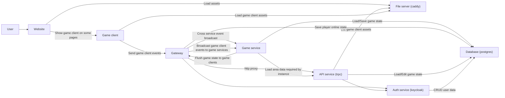

# mp

An online rpg built in [TypeScript](https://www.typescriptlang.org/).

This is a pet project that I'm working on over the weekends over at
https://www.twitch.tv/kasper_573.

I'm doing this project for fun and to teach myself more about multiplayer game development and web development infrastructure.

## Stack

- graphics: [pixi.js](https://pixijs.com/)
- maps: [tiled](https://www.mapeditor.org/) (+custom
  [loader](libraries/tiled-loader)/[renderer](libraries/tiled-renderer))
- ui: [preact](https://preactjs.com/)
- database: [postgres](https://www.postgresql.org/) +
  [drizzle](https://orm.drizzle.team/)
- network: [ws](https://www.npmjs.com/package/ws), [trpc](https://trpc.io/), [custom sync lib](libraries/sync)
- auth: [keycloak](https://www.keycloak.org/)
- observability: [grafana](https://grafana.com)

## Design goals

- CI/CD: Lint, test, build, deploy in pipeline.
- Highly replicable: Containerized development, test and production environments.
- (near) Zero config: Just clone and run.
- [Modularity](#monorepo-package-convention)
- Authoritative server, dead simple client
  - little to no optimistic operations (maybe some lerping)
  - subscribe to state changes, render them.
- Dynamically loaded and served game content
  - only reusable and built-in game mechanics is part of this repo.
  - game content like models, maps, npcs, monsters, etc. is not part of this repo.
  - should be provided externally when deploying.

## Development

Local development is done using node and docker compose.

Check out the [architecture](#architecture) section for an overview of the system.

### Initial setup (only required once)

- Install [Docker](https://www.docker.com/)
- Install [NodeJS](https://nodejs.org/)
- Clone this repository
- Run `cd docker && ./dockerctl.sh dev up -d`
  > If you're on WSL you may need to run `dockerctl.sh` with `sudo`
- Run `sudo ./docker/install-cert.sh`
  > You may need to add the root certificate manually to your browser depending
  > on which browser you are using.
- Enable and prepare [corepack](https://nodejs.org/docs/v22.17.0/api/corepack.html#corepack) for this repo
- Run `pnpm install`
- Run `pnpm -F db-client devenv push` to initialize your database
- Run `pnpm -F keycloak-client devenv provision` to provision keycloak roles
- Sign in as admin to `auth.mp.localhost` and create a test account and add yourself to the `admin` group

### Before each development session

- Run `pnpm dev`
- Visit `https://mp.localhost` in your browser

### If you make docker related changes

You will have to perform the appropriate docker compose commands to apply your changes by using the `dockerctl.sh` script. See [quirks](#quirks).

### If you make database related changes

You will need to use [drizzle-kit](https://orm.drizzle.team/docs/kit-overview).

Run its cli against the development environment using `pnpm -F db-client devenv <drizzle-kit command>`.

### If you change user roles

User roles are defined in typescript source code as a single source of truth and provisioned to keycloak via the `provision` script in the `server` package. If you make changes to the user roles you will have to run the provisioning script to update your keycloak instance.

> Production is provisioned automatically when changes are pushed to master, so you don't have to handle that manually.

### Quirks

While most of the repo should be fairly conventional, I've made a few choices that may be unexpected and is worth mentioning. Here's what you need to know:

In development, our own apps run on the host machine and outside of the docker network, while 3rd party services run inside the docker network, contrary to production and testing where everything runs inside the docker network.

> This provides the best development experience since a large amount of node development tools expect you to interact with them directly on the host machine, ie. vscode's language service, vite dev server, drizzle-kit cli, pnpm link, etc.

We don't use docker compose directly in the CLI. Instead we use a wrapper script that in turn will run the appropriate docker compose commands. See [dockerctl.sh](./docker/dockerctl.sh) for more information.

## Docker

All docker concerns reside in [/docker](/docker) and should be very loosely
coupled with the rest of the codebase. Docker should only be aware of
application and package build/dev tasks, their output artifacts and environment
variables.

The `/docker` folder is designed to serve both as the required configuration for building docker images and running docker containers:

Building images: You can build docker images from source, and it will depend on the rest of the source code from the repo to be present.

Starting containers: You can also start containers for prebuilt docker images, in which case only the `/docker` folder is required to be present. You can do so by running `dockerctl.sh` with `prod` or `test` environment. In fact, this is how the production environment is managed: The CI uploads the `/docker` folder to the production server as a runtime dependency, and runs `dockerctl.sh prod <docker compose command>`.

## Production deployment

This repository comes with a github actions workflow that performs automatic
deployments whenever the main branch receives updates. It's a simple deploy
script designed to deploy to a single remote machine. It logs in to your remote
machine via ssh and updates or initializes the docker stack utilizing the same
docker compose file as in development but with production environment variables
provided via github action variables and secrets.

Review the workflow to see which variables and secrets you need to provide.

## Monorepo package convention

This repository utilizes pnpm workspaces to organize and separate concerns.

Lower level workspaces may not depend on higher level workspaces.

These are the workspaces, in order:

### apps

Deployable executables. May depend on other apps, but it's preferable to do so via protocol (ie. http requests) rather than direct dependency on code.

The apps are responsible for bundling.

### integrations

Integrations between apps, ie. sdks for communicating with services, like a database client or websocket client abstraction. May not directly depend on application code via import, but may loosely couple with apps via protocol (ie. http requests).

### libraries

Generic and low level systems.

Should be highly configurable and modular.

Optimally each package is standalone and has no dependencies on other packages in the repo. However this is more of a goal rather than a rule. Many libraries will have to depend on really core stuff like [@mp/std](/libraries/std) and [@mp/time](/libraries/time), but in general you should decouple packages and instead compose them together inside an app.

Does not need to handle bundling, package.json may directly export untranspiled code, ie. typescript.

## Architecture

### Service diagram

There's also a reverse proxy (caddy) in front of everything, but it's not shown in the diagram because it's a proxy and doesn't help demonstrating how services interact.



### State management

To keep things consistent we use signals as a reusable state management system across all systems.
However, we have an encapsulation package in `@mp/state` that essentially just re-exports `@preact/signals-core`.
We do this to not directly couple all systems with preact.

```text
              +-----------------------------+
              |         @mp/state           |
              |   (@preact/signals-core)    |
              +-------------+---------------+
                            |
        +-------------------+-------------------+
        |                   |                   |
+----------------+  +----------------+  +---------------+
|   Game Server  |  |   Graphics     |  |      UI       |
|      Logic     |  |   (pixi.js)    |  |   (preact)    |
+----------------+  +----------------+  +---------------+
```

> If you're writing code in the UI layer you're free to use preact signals directly, but if you're in any other part of the system you should depend on `@mp/state` instead of preact directly.

## Credits

[Adventurer character model by @sscary](https://sscary.itch.io/the-adventurer-male)
